# Arevtur

## tldr

- In game pricer (e.g. currencies, uniques, 6-links, crafting bases, divination cards, gems, etc...)
- Arevtur: Trade search featuring value-v-price graph, PoB integration, and more
- Mod Viewer: View prefixes and suffixes with rich filtering
- A few misc utility shortcuts

## In game pricer

Includes:
- gem (per level, quality, and corrupted permutation)
- divination card
- essence
- currency
- unique jewel
- unique flask
- unique weapon (per unlinked and 6-linked)
- unique armour (per unlinked and 6-linked)
- unique accessory
- unique map
- fossil
- resonator
- fragment
- prophecy
- map
- scarab
- crafting base item (per ilvl)
- incubator
- oil
- beast
- delirium orb

## Arevtur (trade)

#### Starting the app

When you run POE Pricer, a `$` icon will appear in your system tray at the bottom right of your screen.
Right click the icon to open the context menu and select `Arevtur` to open the app.

#### Setting up the session ID

In your browser, navigate to `pathofexile.com` and login. 
Open the developer console (`f12`) and select the `Application` panel in the top strip.
Expand the `Cookies` tree under the `Storage` label in the left strip, and select the `pathofexile.com` cookie.
In the main view, copy the value associated with the `POESESSID` key. This should be a 32 alphanumeric ID.
In the `Arevtur` app, paste the value in the `Session ID` input at the top.

#### What is the purpose of session ID, and is it safe to copy

The session ID allows GGG to identify users. 
Without it, GGG would not know who is using their trade site, 
and if someone were to use their trade site irresponsibly, they would have to rely on crude alternatives (i.e. IP address) to stop that user.
Hence, GGG puts strict limits on what you are allowed to do without a session ID; including what trade queries you're allowed to submit and how often.

`Arevtur` is open source; any user can verify that the session ID is only stored locally.
I.e. other than yourself and GGG, no one will have access to your session ID.
This is important, because sharing your session ID allows others to impersonate you to a certain extent.

#### Why is it slow

tldr; GGG's trade API returns 10 items per request, and limits requests to 1.3 per second per user. So retrieving 100 items will take at least 7.7 seconds.

The initial request to the trade API returns with 100 item IDs.
At most 10 of these items can fetched per subsequent request, meaning a total of 11 requests are made per query.
Factoring in that many `Arevtur` searches actually perform multiple `pathofexile.com/api/trade` queries, each time you press the 'submit' button, 11 to 33 requests are typically made.

In addition, GGG recently updated their API rate-limit restrictions.
It had previously been possible to make most of those requests in parallel.
But with the new restrictions, we can make at most 1.3 requests per second.
To be on the safe side and avoid timeouts, `Arevtur` limits its requests to 1 per second; this is why even a simple query will take 11 seconds.

Luckily, the app will display partial results while the complete query is still in progress.
But for expensive items with complicated queries, waiting for the complete response before purchasing is ideal, as later items may be better or cheaper than earlier items. 

### Visual guide to the features

### Simple search
Queries are automatically saved.
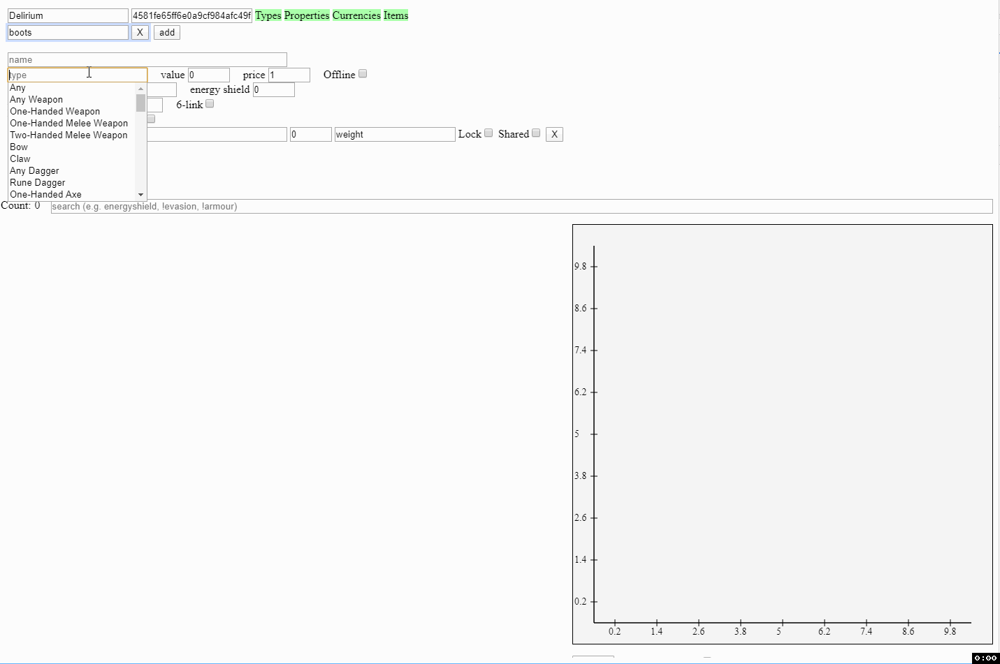

### PoB Integration (portable release only)
To make it easier to figure out how e.g. spell damage, cast speed, and ele penetration translate to DPS,
we can select our PoB dir and PoB build xml to view:
- How much life and dps some mods give us.
- A recommended weight based on life, dps, resist, and configurable weights for each.
- PoB tooltip for searched items.
![pob-integration.gif]

### Interactive graph
Value v price are graphed.
Maybe we prefer an item 5% less powerful but at 1/10th the price.
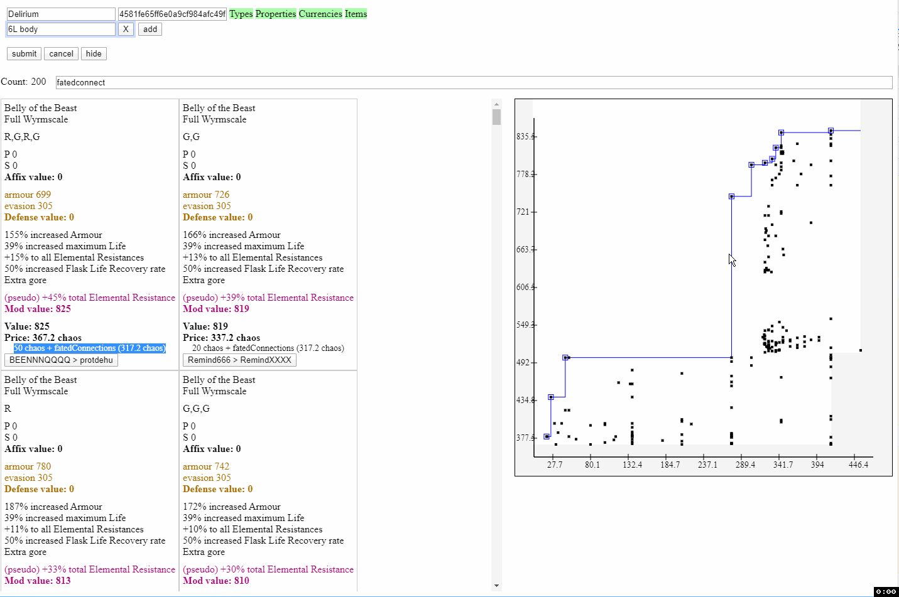

### Locking weights amongst properties
We can lock weights to help keep similar mods in sync.
- E.g. here we're looking for +gem level mods.
- Rather than set and update each mod's weight individually, we lock their weights.
- Updating the weight for the 1st mod will automatically update the locked mods as well.
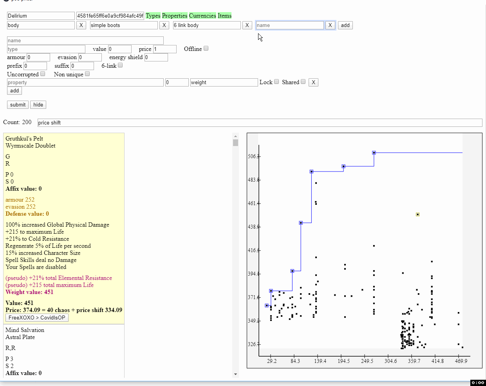

### Sharing properties amongst queries
We can share properties amongst queries to keep all our queries updated.
- E.g. here we 1st configure a query for boots with speed 30%, flat life weight 2, and resists weight 1. 
- Then we create another query for a helmet.
- Instead of adding the flat life and resist weights again and worry about keeping them in sync, we share the life and resists weights we configured for the boots.
- When we later update the flat life weight from 2 to 3 for the helmet, the boot is automatically updated as well.
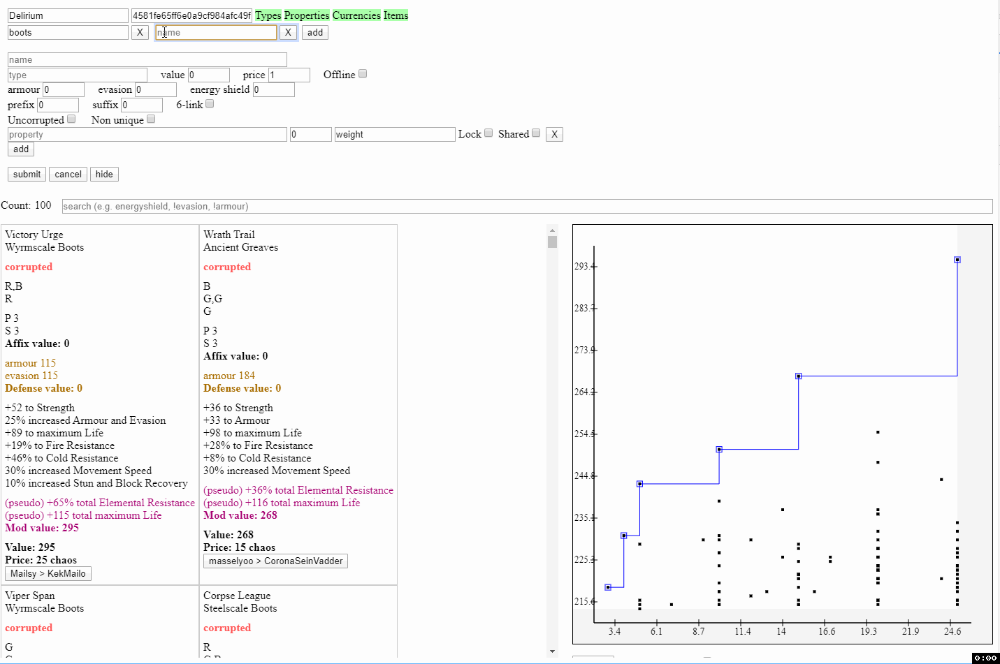

### Searching for 6-link
When searching for 6-links, we will find not only 6-linked items, but also uncorrupted, unlinked items with the price of the Fated Connections prophecy factored in.
- E.g. here, we want a 6-link body.
- The best 6-linked item we find is worth over 400c and has a value of 845.
- But we also find a similar unlinked item available for just 50c and with a very similar value of 825.
- In this case, it's cheaper to buy the latter item and 6-link it ourselves with the Fated Connections prophecy.

### Searching for craftable affixes
When we have the option to craft an affix, we can not only include items with open affixes, we can also ensure the mods we can craft are not blocked by an existing explicit.
- E.g. here we want a ring with some life, resists, and mana.
- But we can also craft some prefixes ourselves if there's an open prefix available.
- By setting the prefix input to 60, our search will show both items that have high life, resists, and mana, as well as items that have a slightly lower value but an open prefix to compensate.
- This is useful, because otherwise, we'd have to do 2 separate searches to include both sets of items.
- Then we realize the only prefix we want to craft is a 30 flat life prefix, and unfortunately, a lot of the items with an open prefix already have a life explicit.
- To avoid manually screening the items, we add the flat life explicit as a conditional prefix mod; like before, our search will include items that have an open prefix but only if they don't already have a flat life explicit present.
- This can be chained multiple times; e.g. if we were also willing to craft a flat mana prefix, we could add a second conditional prefix mod with a lower weight.
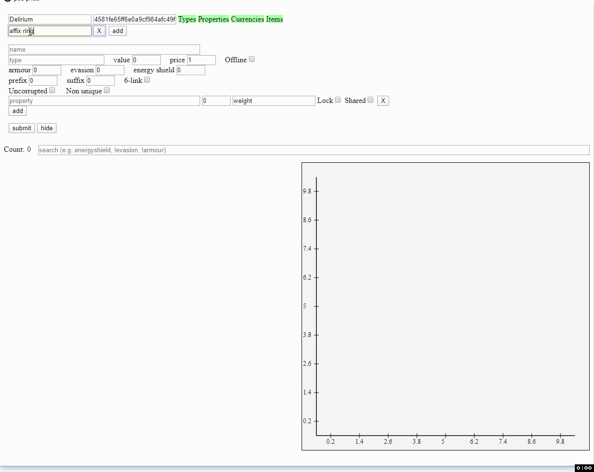

### Weighting armour, energy shield, and evasion
When we are looking for armour, ES, or evasion, we aren't restricted to min and max values, but can instead weight them into the item's overall value, just like other properties. 
- E.g. here we want evasion gloves; say we value 200 flat life equal to 65 evasion (this is not typical, excuse the bad example).
- But we don't want to manually do multiple searches to capture all the possible combinations we'd be equally satisfied with: 200 life & 0 evasion, 160 life & 52 evasion, 120 life & 39 evasion, etc.
- So we instead add a .65 weight to evasion and a 2 weight to flat life to search for every single potential mix.
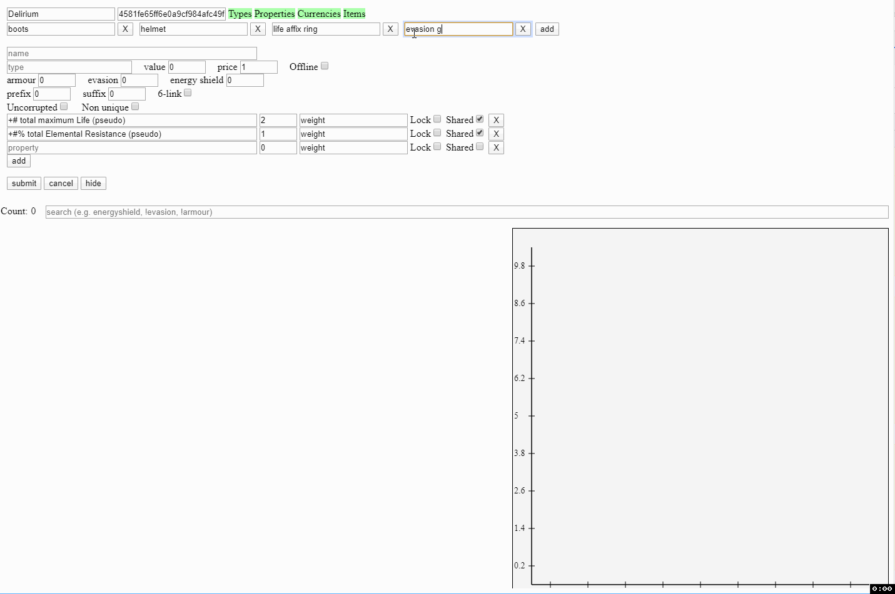

### Filtering results
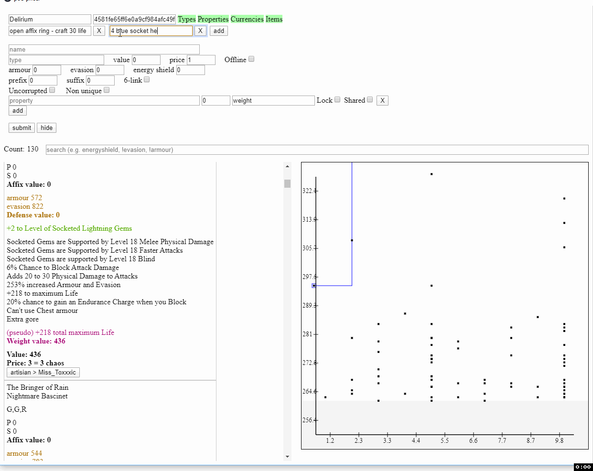
- E.g. search '!armo, !evas' to show only ES gear. 
- E.g. search '!corrupte' to hide all corrupted items. 
- E.g. search '!unset, !moonstone' to hide all unset and moonstone rings. 

### Search for a specific item by name
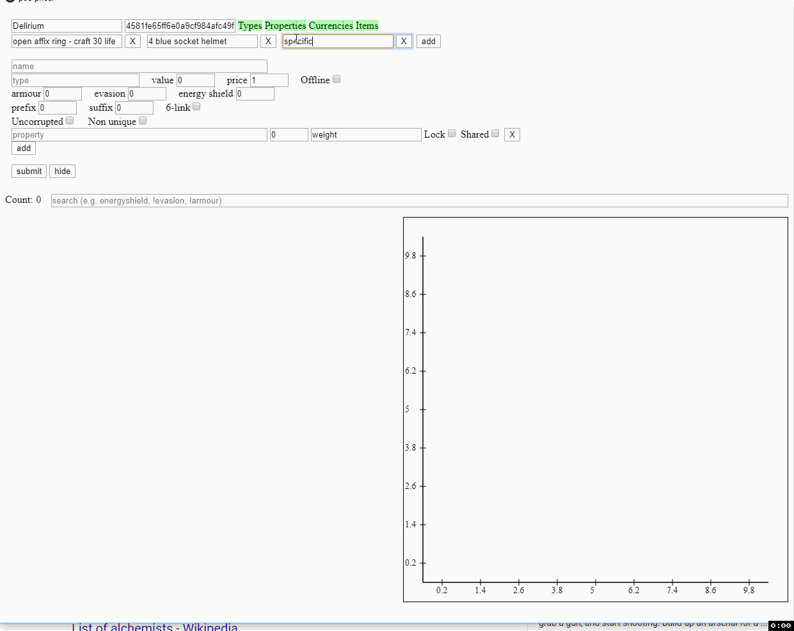

## Mod Viewer

View prefixes and suffixes available, filtered by:
- Item base and level
- Mod source (i.e. normal, influences, master, fossils, essence, and incursion)
- Tags (e.g. physical, cold, life, etc)
- Rich search (e.g. life | armour, !regen)

Additionally, to assist in predicting craft when using predictable crafts (e.g. fossils or harvest), it shows the probabilities for each craft based on what filters you've applied.

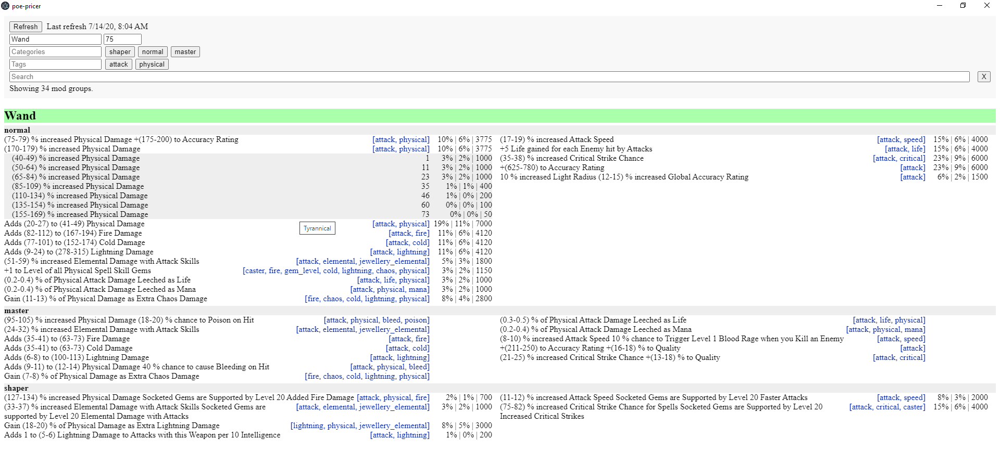
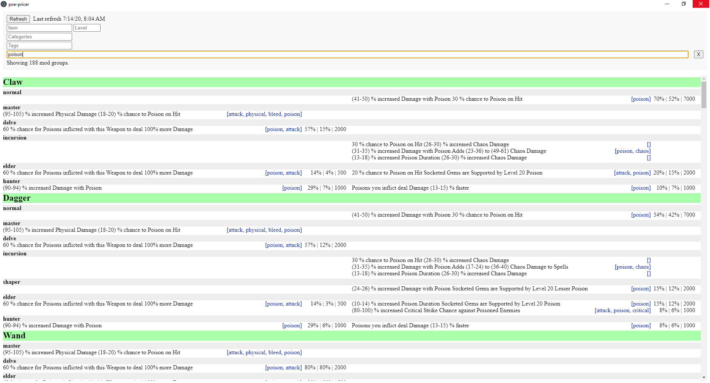
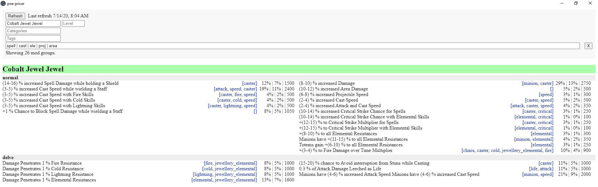

## Misc Utility Shortcuts

- ctrl + shift + c (or x) -> price items
- ctrl + shift + g - > display gem arbitrages
- ctrl + shift + h -> /hideout
- ctrl + shift + o -> /oos
- ctrl + shift + u -> fetch and paste login unlock verification code (gmail only)
- ctrl + shift + b -> display battery (useful for laptops using fullscreen)
- ctrl + shift + p -> display preferences (configure League)

## Gem Arbitrage

List gems' lvl 20 price, q 20 price, and potential profit.

## Credits

This wouldn't be possible without: 

- [poe.ninja](poe.ninja) for price information
- [Openarl/PathOfBuilding](https://github.com/Openarl/PathOfBuilding) for item and mod evaluation in Arevtur
- [VolatilePulse/PoB-Item-Tester](https://github.com/VolatilePulse/PoB-Item-Tester) for help with PoB integration
- [poedb](https://poedb.tw/us/) for sourcing Mod Viewer
- [pathofexile.com/api/trade](http://pathofexile.com/api/trade) for sourcing Arevtur outputs
- Path of Exile's APIs for sourcing Arevtur inputs
- [Path of Exile](pathofexile.com)

Thank you!
