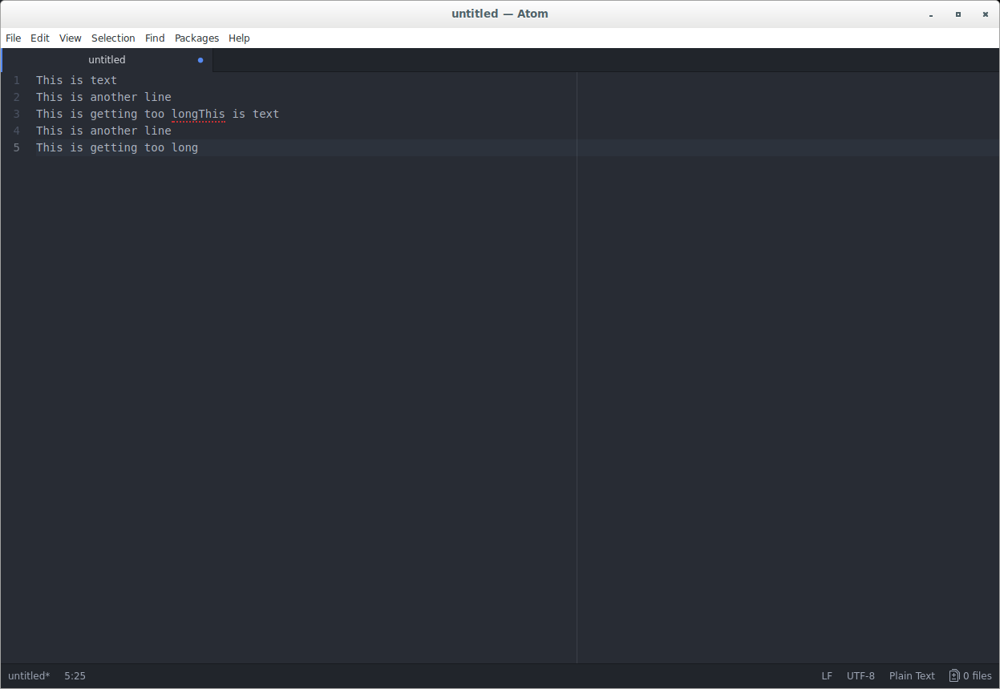
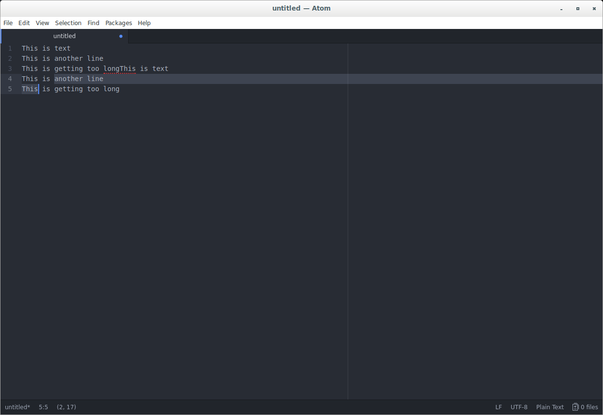

# Clipboard Manager JS

## Platform support

For windows, this relies on `powershell` and `user32.dll`.

For linux, this relies on a `bash` script and `xdotool`.

Not tested on mac, but should work with something similar to `xdotool` for mac.

If these are not available, most of this will still work, except pressing `enter` (see below) will update the clipboard but not paste its contents. I.e., you can still view clipboard history and select previous contents.  

## keys

`ctrl+shift+v` to trigger the popup.

`up/down` to scroll selection.

`left/right` to select the first/lsat selection.

`enter` to close the popup and paste.

`esc` to close the popup without pasting.

`del/backspace` to remove the selected line.

## screenshots

