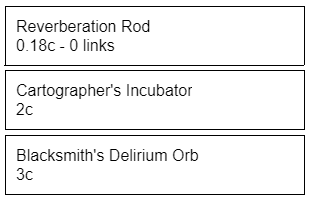
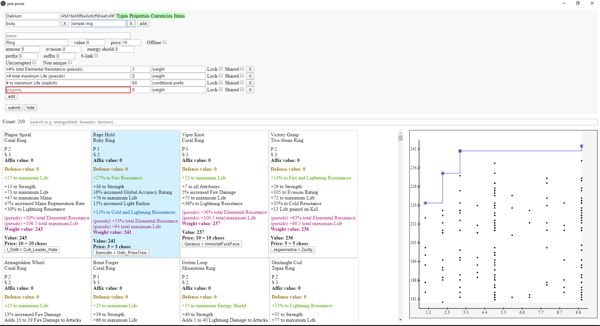
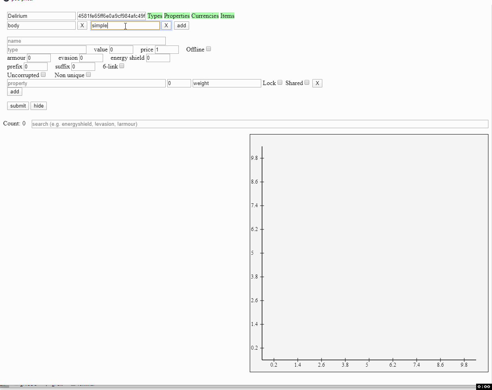

# POE Pricer

## Shortcuts

- ctrl + shift + c (or x) -> price items
- ctrl + shift + g - > display gem arbitrages
- ctrl + shift + h -> /hideout
- ctrl + shift + o -> /oos
- ctrl + shift + u -> fetch and paste login unlock verification code (gmail only)
- ctrl + shift + b -> display battery (useful for laptops using fullscreen)
- ctrl + shift + p -> display preferences (configure league)

## Pricing

Sourced from `poe.ninja` .

Includes:
- gem (per level, quality, and corrupted permutation)
- divination card
- essence
- currency
- unique jewel
- unique flask
- unique weapon (per unlinked and 6-linked)
- unique armour (per unlinked and 6-linked)
- unique accessory
- unique map
- fossil
- resonator
- fragment
- prophecy
- map
- scarab
- crafting base item (per ilvl)
- incubator
- oil
- beast
- delirium orb

## Gem Arbitrage

List gems' lvl 20 price, q 20 price, and potential profit.

## Arevtur (trade)

Find the most value / price item upgrades.
Access from the tray icon context menu.
Sourced from official trade site `pathofexile.com/trade` .
This can be complicated; contact me if you'd like help or screenshot guides.

Features:
- Interactive graph
    
    Visualize the value versus price tradeoff. Maybe you'd prefer an item 5% less powerful but at 1/10th the price. Double click to auto-focus, left drag to pan, right drag to zoom.
    
- Weight values for armour, es, and evasion

    The other trade sights allow filtering for min and max armour, es, and evasion. This allows weighting them. E.g. perhaps you value 1000 evasion, 4.5% inc life, 40 flat life, and 80 resists equally.   

- Multiple persistent queries with shared weights

    Queries are automatically saved, and weights can be shared between them. E.g. save a query for boots with min 30% speed, flat life weight 2, and resists weight 1. Then create another query for gloves, and share the life and resists weights. Update either query's weights, and the other query will also be updated. Additionally, you can merge multiple queries, e.g. if you want either a high life glove or a specific unique.

- 6 link search

    Includes not only 6-linked items, but also uncorrupted, unlinked items with the price of the Fated Connections prophecy factored in.

- Conditional affix

    Not only can you add value weights to open suffixes and prefixes, you can also condition them on not having certain mods already present. E.g. if you consider a crafted flat life on a ring as 60 value, the search will include items that are uncorrupted, uncrafted, have an open prefix, and don't already have a flat life explicit. Can include multiple conditional affixes; e.g. in case an item has a flat life explicit and so you'd instead craft flat mana.

- Smart search

    E.g. search '!unset, !moonstone' to hide all unset and moonstone rings. 
